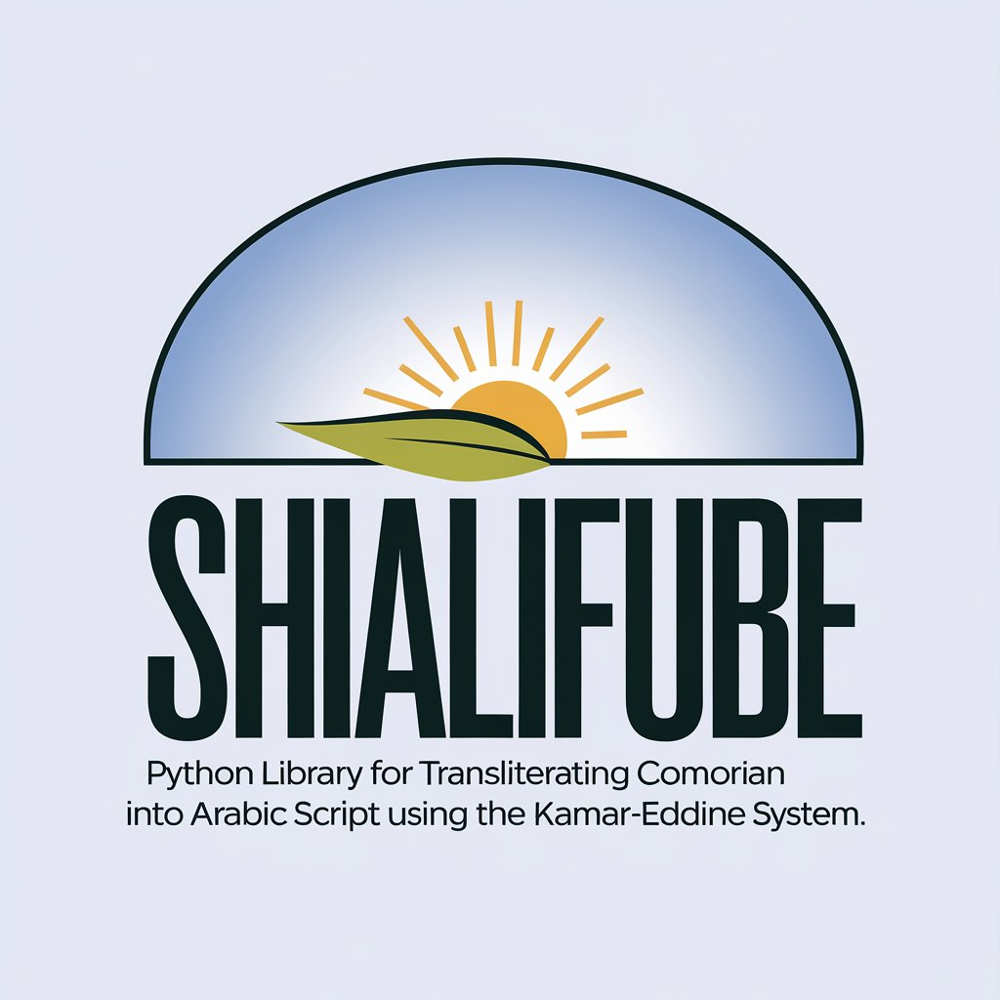

<p align="center">
  
</p>


# ShiAlifube
## About
**ShiAlifube** is a Python library for transliterating Comorian into Arabic script using the Kamar-Eddine system. This system was proposed in the 1960s by Cheikh Ahmed Kamar-Eddine, a pioneer in the standardization of the Comorian language. The choice of Arabic script is due to the Comorian language's lexical borrowings from Arabic, reflecting the historical influence of Arabs in the Comoros archipelago.

## Features

- Provides transliteration from Comorian to Arabic script.
- Supports various Comorian dialects.
- Easy to integrate into Python projects.

## Goals

- To offer a robust tool for Comorian language preservation.
- To facilitate research and development in language technology for Comorian.

# Installation

## Via PyPI

You can install **ShiAlifube** directly from PyPI using `pip`:

```bash
pip install shialifube
```

## Via GitHub
If you wish to install the latest version from the GitHub repository (which may contain updates not yet published on PyPI), you can do so using pip with the repository URL:

```bash
pip install git+https://github.com/nairaxo/shialifube.git
```


# Citation
If you use **ShiAlifube** in your work, please cite the library using the following format:

```bibtex
@misc{shialifube,
  author = {Abdou Mohamed Naira},
  title = {ShiAlifube: A Python library for transliterating Comorian into Arabic script},
  year = {2024},
  url = {https://pypi.org/project/shialifube/},
  version = {0.1.2},
}
```
